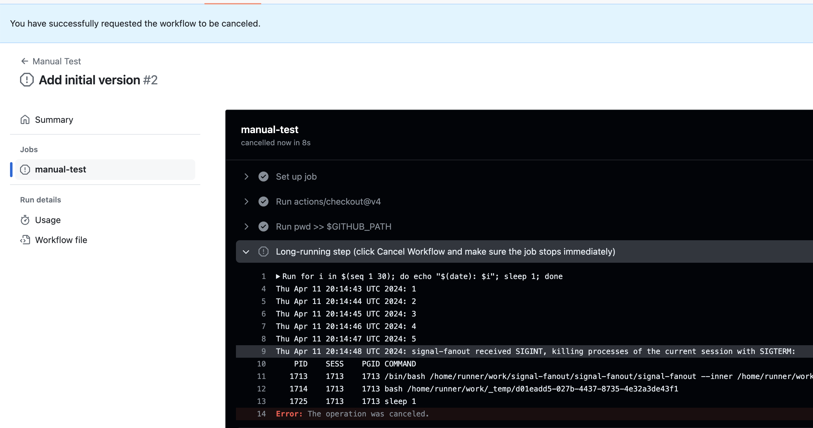

# Signal Fanout for GitHub Action Runners

Put this tool to the "shell" key of your job step specification to make this
step cancellable immediately and not in ~10 seconds:

```yml
...
jobs:
  my-job:
    runs-on: ubuntu-latest
    steps:
      - name: Long-running step
        shell: signal-fanout {0}
        run: |
          for i in $(seq 1 30); do echo "$(date): $i"; sleep 1; done
```

Alternatively, make it a default shell of all jobs/steps in the workflow:

```yml
...
defaults:
  run:
    shell: signal-fanout {0}
jobs:
  my-job:
    runs-on: ubuntu-latest
    steps:
      - name: Long-running step
        run: |
          for i in $(seq 1 30); do echo "$(date): $i"; sleep 1; done
```

You can also use any other shell which GitHub Actions support:

```yml
...
jobs:
  my-job:
    runs-on: ubuntu-latest
    steps:
      - name: Long-running step with sh shell
        shell: signal-fanout sh {0}
        run: |
          for i in $(seq 1 30); do echo "$(date): $i"; sleep 1; done
```

An example of what's happening when you press **Cancel workflow** button: the
step code terminates immediately after the button is pressed (in this example, I
pressed it at around second 5 of the step run time):



## Motivation

When you press **Cancel workflow** button in GitHub Actions (or a workflow run
is cancelled due to concurrency restriction), the runner immediately sends
SIGINT to the step process (which is typically bash), waits 7.5s, then sends
SIGTERM to that process, waits 2.5s, and then sends SIGKILL (-9) to all of the
processes. The problem is that the runner sends SIGINT (and SIGTERM) only to
**one** process. And since this process is typically bash (or any other shell),
it just swallows the signal according to the [Proper handling of
SIGINT/SIGQUIT](https://www.cons.org/cracauer/sigint.html) paper.

The signal-fanout tool just propagates the received signal as SIGTERM to the
entire process tree launched by the passed script. Notice that it does NOT
forward the original signal, it always sends SIGTERM (even when it receives the
first SIGINT), otherwise it wouldn't kill some of the shell processes. See the
link above, why.

See more details here: https://github.com/ringerc/github-actions-signal-handling-demo

## Future Plans

- Wait for the process subtree termination (currently, the tool doesn't wait, it
  is suitable to e.g. quickly abort build process or unit tests running).
